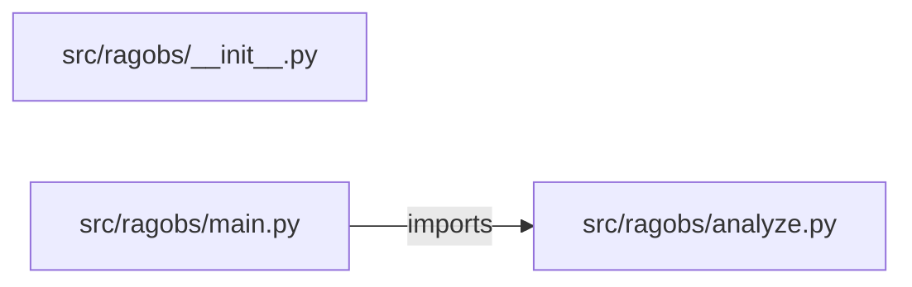

# rag-llm-observability-platform — project architecture

[README](README.md) · [Interview questions and answers](INTERVIEW_QA.md)

## Purpose and scope

This is a local laptop proof. It does not call a hosted model and it does not apply production changes.

This document describes files and symbols in this checkout. Deployment templates and statements in the original overview are distinguished from a verified running environment.

## Component diagram



For Python repositories, arrows show resolved local imports, not network calls or deployment order. Otherwise the diagram is a repository component map; containment arrows do not assert runtime integration.

## Components and responsibilities

| Component | Responsibility |
| --- | --- |
| [`src/ragobs/main.py`](src/ragobs/main.py) | HTTP handlers: `GET /healthz`, `POST /analyze` |
| [`src/ragobs/analyze.py`](src/ragobs/analyze.py) | Functions: `analyze` |
| [`requirements.txt`](requirements.txt) | Implementation or supporting configuration |
| [`src/ragobs/__init__.py`](src/ragobs/__init__.py) | Implementation or supporting configuration |
| [`tests/test_analyze.py`](tests/test_analyze.py) | Executable checks and regression examples |
| [`.github/workflows/ci.yml`](.github/workflows/ci.yml) | GitHub Actions job definitions |
| [`README.md`](README.md) | Project explanations or operating notes |

## Request interface

| Method and path | Handler | Source |
| --- | --- | --- |
| `GET /healthz` | `healthz` | [`src/ragobs/main.py`](src/ragobs/main.py#L8) |
| `POST /analyze` | `post_analyze` | [`src/ragobs/main.py`](src/ragobs/main.py#L13) |

The table lists literal route decorators found in the inspected Python modules. Router prefixes and middleware can add behavior; check the linked handler and application setup before calling an endpoint.

## Implementation walkthrough

### `analyze(rows)`

Source: [`src/ragobs/analyze.py`](src/ragobs/analyze.py#L5).

Calls visible in this function: `InputError`, `all`, `float`, `groups.items`, `groups.setdefault`, `groups.setdefault(key, []).append`, `isinstance`, `len`, `round`, `row.get`, `str`, `sum`.

```python
def analyze(rows):
    if not isinstance(rows, list) or not rows or not all(isinstance(r, dict) for r in rows):
        raise InputError("rows must be a non-empty list of objects")
    values = []
    groups = {}
    skipped = 0
    for row in rows:
        raw = row.get("hit")
        try:
            number = float(raw)
        except (TypeError, ValueError):
            skipped += 1
            continue
        values.append(number)
        key = str(row.get("pipeline", "unknown"))
        groups.setdefault(key, []).append(number)
    if not values:
        raise InputError("no numeric hit values")
    values.sort()
    mid = len(values) // 2
    median = values[mid] if len(values) % 2 else (values[mid - 1] + values[mid]) / 2
    by_group = {name: round(sum(nums) / len(nums), 4) for name, nums in groups.items()}
```

The excerpt is truncated; the linked source contains the full implementation.

## Validation and failure paths

| Explicit exception | Source |
| --- | --- |
| `InputError('rows must be a non-empty list of objects')` | [`src/ragobs/analyze.py`](src/ragobs/analyze.py#L7) |
| `InputError('no numeric hit values')` | [`src/ragobs/analyze.py`](src/ragobs/analyze.py#L22) |
| `HTTPException(status_code=422, detail=str(exc))` | [`src/ragobs/main.py`](src/ragobs/main.py#L17) |

These are explicit exceptions in the inspected source, rather than a claim that every failure is handled. Follow the calling handler to see whether the exception becomes an HTTP response or propagates.

## Data flow and design decisions

### What is the input-to-output contract of `analyze`

In [`src/ragobs/analyze.py`](src/ragobs/analyze.py#L5), `analyze(rows)` receives the inputs. The function computes these intermediate values:

- `values = []`
- `groups = {}`
- `skipped = 0`
- `mid = len(values) // 2`
- `median = values[mid] if len(values) % 2 else (values[mid - 1] + values[mid]) / 2`
- `by_group = {name: round(sum(nums) / len(nums), 4) for name, nums in groups.items()}`

Its result is defined by:

- `{'rows': len(rows), 'skipped': skipped, 'mean': round(sum(values) / len(values), 4), 'median': median, 'min': values[0], 'max': values[-1], 'by_pipeline': by_group}`

### Which decision rules or boundary conditions should an interviewer challenge

The implementation in [`src/ragobs/analyze.py`](src/ragobs/analyze.py#L5) branches on:

- `not isinstance(rows, list) or not rows or (not all((isinstance(r, dict) for r in rows)))`
- `not values`

A useful extension is a table-driven test that covers each condition just below, at, and above its boundary where applicable. These expressions are the current rules; changing them changes behavior and should be justified by the project’s acceptance criteria.

## Setup and verification

The following commands are derived from the checked-in dependency/test contracts. Execute them from the repository root; the block prepares a local environment, not a cloud deployment.

```bash
python3 -m venv .venv
source .venv/bin/activate
python -m pip install -r requirements.txt
python -m pytest -q
```

Python dependencies: [`requirements.txt`](requirements.txt).

Test entry points: [`tests/test_analyze.py`](tests/test_analyze.py).

Automation definitions: [`.github/workflows/ci.yml`](.github/workflows/ci.yml). Read their triggers and job steps to determine what CI actually runs.

## Operating boundaries and design review

Before turning this checkout into a customer deployment, establish the input contract, data ownership, access controls, failure response, evaluation criteria, and rollback owner. Repository fixtures and unit tests demonstrate local behavior; they do not establish throughput, uptime, compliance, or business impact.

A useful architecture review starts with the linked implementation: identify where input enters, where a decision is made, which state can change, and which external dependency can fail. Add a deployment view only for infrastructure that is actually configured and exercised.
